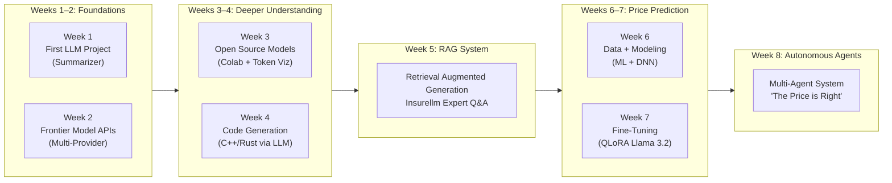
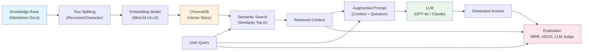
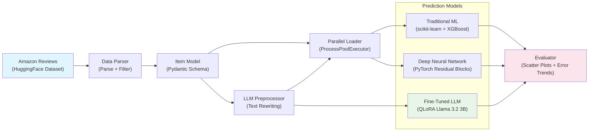
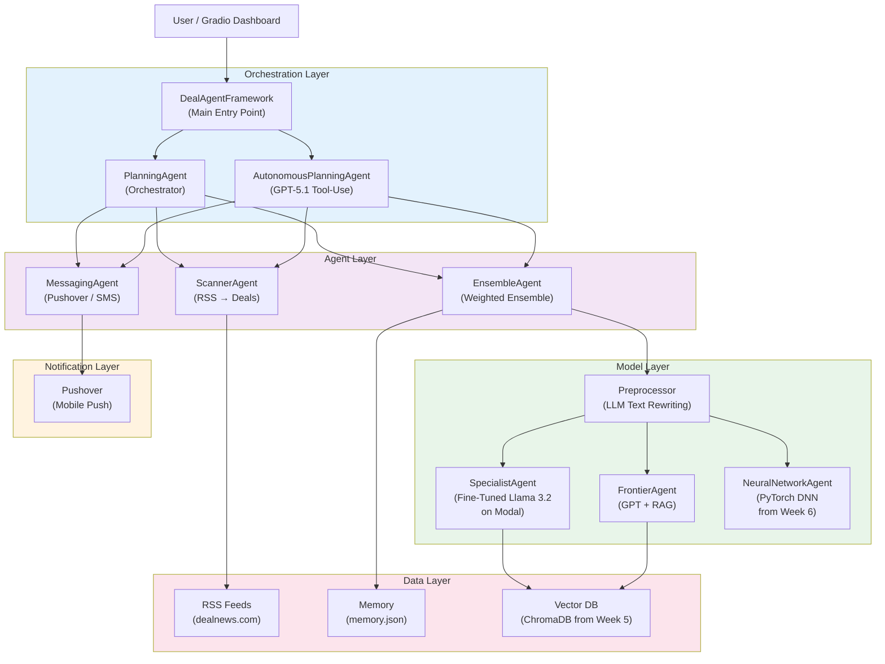
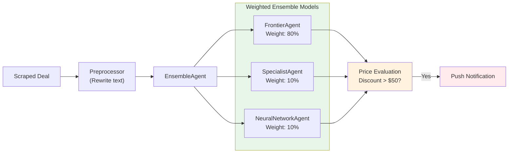
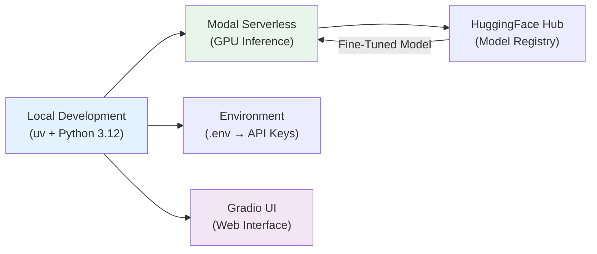
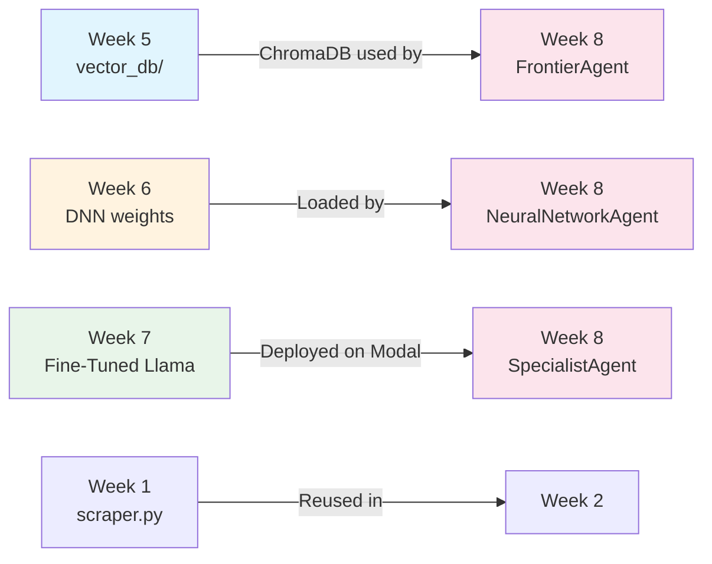

# LLM Engineering — Architecture

> 8-week progressive curriculum building toward a multi-agent Autonomous AI system ("The Price is Right").

---

## Course Progression Overview

---

## Week 5 — RAG System Architecture

---

## Weeks 6–7 — Price Prediction Pipeline

---

## Week 8 — Multi-Agent System Architecture

---

## Agent Ensemble — Pricing Flow

---

## Infrastructure & Deployment

---

## Key Files & Entry Points

| Path | Purpose |
|---|---|
| `week1/day1.ipynb` | First lab — start here |
| `week5/app.py` | RAG Expert Assistant (Gradio) |
| `week5/evaluator.py` | RAG Evaluation Dashboard |
| `week8/deal_agent_framework.py` | Autonomous agent system entry point |
| `week8/price_is_right.py` | Full Gradio UI for agent system |
| `week8/pricer_service.py` | Modal-deployed fine-tuned model |

---

## Cross-Week Dependencies

